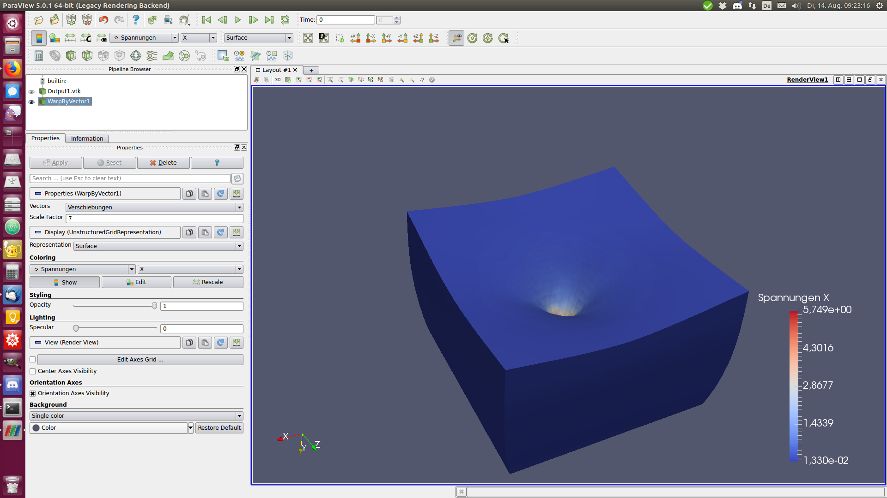

## Visualisation with Paraview 

- This folder contains a [Python program](make_vtk.py) that generates a Paraview-readable VTK file.
- It needs three input files specified at the beginning of the Python program: 
  - the Abaqus input file (here `mesh0.inp` or `mesh3.inp`)
  - the Unique nodal values (here `UNVALS56_01.txt`or `UNVALS56_mesh3_01.txt`)
  - the results at the integration points (here `IPVALS56_01.txt` or `IPVALS56_mesh3_01.txt`)
- It is best run with Python 3, but works also with Python 2
- It generates a 10-node tetrahedron by extrapolating the corner and edge center values from the integration points, then averaging the values from adjacent elements
- View the VTK-file in Paraview
  - `paraview Putput1.vtk`
  - Click "Apply"
  - Click "Warp by vector field" to see the deformed shape
  - etc.  

